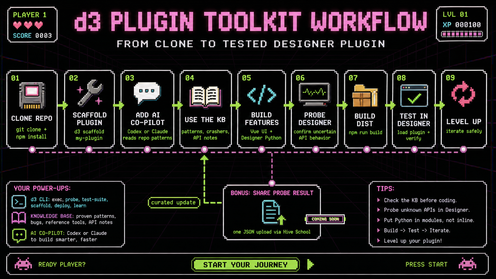

# d3-plugin-toolkit



Toolkit for building local and remote Disguise Designer plugins with Vue 3, Vite, TypeScript, and Designer Python safety checks.

This public repository contains the toolkit, shared utilities, scaffold templates, documentation, and curated knowledge base. It does not contain private plugin workspaces.

## Requirements

- Node.js 18 or newer
- npm
- Disguise Designer for live API execution and plugin testing
- Python available as `python3` when building plugins that use `@disguise-one/designer-pythonapi`

## Setup

```bash
npm install
npm run build:shared
npm run build:cli
npm test
```

## Create a Local Plugin

```bash
npm run cli -- scaffold my-plugin -- --title "My Plugin"
npm install
npm -w packages/plugins/my-plugin run dev
```

Build the plugin for Designer:

```bash
npm -w packages/plugins/my-plugin run build
```

The build output goes to `packages/plugins/my-plugin/dist/`. Copy that folder into a Designer project plugin folder, or configure `.d3-toolkit.json` as described in `docs/cheat-sheet.md`.

## Create a Remote Plugin

```bash
npm run cli -- scaffold my-remote -- --type remote --backend python --title "My Remote"
npm install
npm run cli -- remote dev my-remote
```

Remote plugins scaffold into `packages/remote-plugins/<name>/`. The Python
backend uses Disguise's official `designer-plugin` library for DNS-SD
publishing. The Node backend is also available with `--backend node`; it uses a
Node service plus a small Python publisher sidecar. Remote v1 packaging is
Windows-first and creates a distributable folder rather than an installer:

```bash
npm run cli -- remote smoke my-remote
npm run cli -- remote build my-remote
npm run cli -- remote package my-remote
```

## Configure Designer Deploy Path

For the smoothest local workflow, start from `.d3-toolkit.example.json` in the
repo root, create your local `.d3-toolkit.json`, and point it at the
`plugins` folder inside your Designer project:

```json
{
  "deployPath": "D:/d3 Projects/MyProject/plugins"
}
```

You can also use `deployPaths` for multiple default projects, or
`plugins.<pluginName>.deployPath(s)` for per-plugin overrides. Plugin-specific
paths replace the top-level default for that plugin:

```json
{
  "deployPath": "D:/d3 Projects/DefaultProject/plugins",
  "plugins": {
    "my-plugin": {
      "deployPaths": [
        "D:/d3 Projects/ProjectA/plugins",
        "D:/d3 Projects/ProjectB/plugins"
      ]
    }
  }
}
```

Once this is set, each plugin build writes to both locations:

- `packages/plugins/my-plugin/dist/`
- `D:/d3 Projects/MyProject/plugins/my-plugin/`

That means you can usually build and then reload the plugin in Designer:

```bash
npm -w packages/plugins/my-plugin run build
```

For a one-off deploy without `.d3-toolkit.json`, build first and then copy the built plugin into a Designer project:

```bash
npm -w packages/plugins/my-plugin run build
npm run cli -- deploy my-plugin -- --project "D:/d3 Projects/MyProject"
```

The manual deploy command copies to `<project>/Plugins/my-plugin/`. See `docs/cheat-sheet.md` for more deployment options, including the `D3_PLUGIN_OUT` per-build override.

## Suggested Starting Prompt

When working with an AI coding assistant in this repo, paste a prompt like this
at the start of the session:

```text
You are helping me build a Disguise Designer plugin with d3-plugin-toolkit.

First read the assistant workflow files for your agent: Codex uses AGENTS.md,
docs/codex-workflows.md, and docs/cheat-sheet.md; Claude uses CLAUDE.md,
.claude/, and docs/cheat-sheet.md.

If I describe a plugin in plain language, choose whether it should be local or
remote. Scaffold local plugins with `npm run cli -- scaffold <plugin-name> -- --title "<Plugin Title>"`.
Scaffold remote plugins with `npm run cli -- scaffold <plugin-name> -- --type remote --backend python --title "<Plugin Title>"`
unless I ask for a Node backend. Then run `npm install`.

Keep UI in Vue/TypeScript and Designer behavior in plugin `.py` modules with
`__all__` exports. Before touching Designer Python, follow the repo safety
pre-flight, search the knowledge base/probes, confirm API names, and probe
unproven behavior.

Designer Python is Python 2.7 and crash-prone: no f-strings, import d3 inside
registered functions, use injected resourceManager, use bare except: around
Designer API calls, avoid unknown proxy iteration, and return JSON-safe values.

Verify with the smallest meaningful build/test/probe. Finish with what changed,
files touched, how to test it, and any verification gaps.
```

## Designer Python Safety

Designer's Python API can crash the host application when called incorrectly. Before changing Designer Python, read:

- `docs/mandatory-workflow.md`
- `docs/reference.md`
- `packages/knowledge-base/README.md`

Use the local knowledge base and focused probes before relying on unfamiliar Designer API behavior.

Useful live Designer commands:

- `npm run cli -- session snapshot --label "before"`
- `npm run cli -- exec --file <probe.py>`
- `npm run cli -- test "<expr>"`
- `npm run cli -- test-suite <name>`
- `npm run cli -- learn`

Broad `npm run cli -- probe <target> --unsafe-dir` is available for disposable
sessions, but focused probes and KB patterns are preferred.

## Community Submissions

The community probe submission portal is coming soon. For now, share findings through GitHub issues or direct maintainer review.

## License

This project is source-available, not open source under an OSI-approved license.
You may use the toolkit for free to build your own Disguise Designer plugins,
including plugins you use or distribute, but you may not sell, repackage,
redistribute, or offer the toolkit itself as a competing product or service
without written permission. See `LICENSE`.

## Assistant Workflows

This repository includes assistant-facing workflow files because they are part
of the toolkit's safety model:

- `AGENTS.md` and `docs/codex-workflows.md` for Codex
- `CLAUDE.md`, `.claude/settings.json`, and `.claude/commands/` for Claude Code
- `.codex/hooks.json` for Codex hook parity where supported
